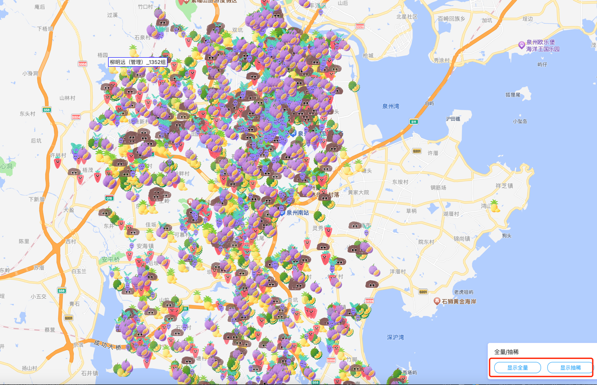
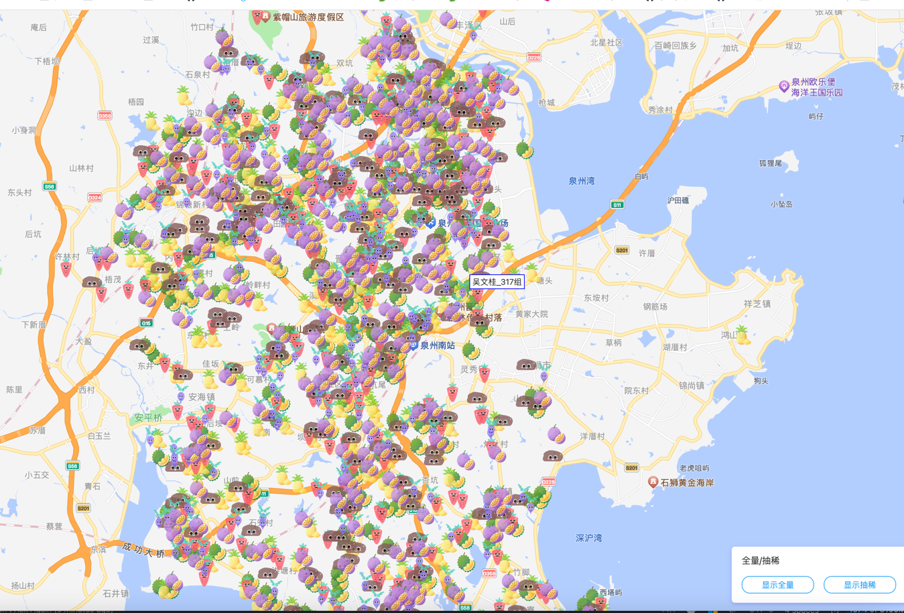
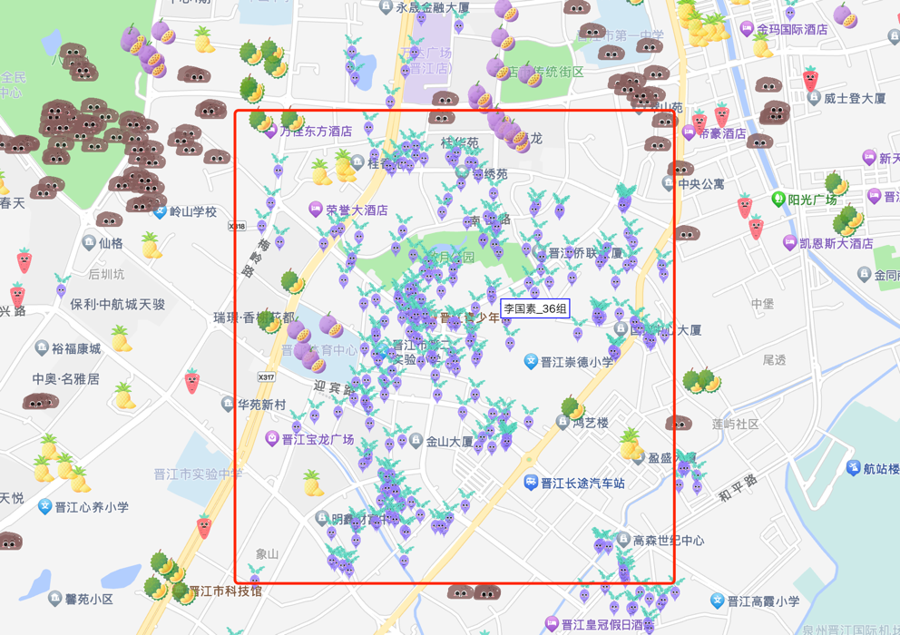

# 项目介绍
在地图上展示海量位置信息（如车辆位置），经常会遇到地图上位置信息过多，导致地图加载速度过慢，或者地图上出现覆盖现象。
利用DBSCAN聚类算法，对地图上位置信息进行聚类处理，将同一组位置信息合并成一个点，减少地图上的覆盖现象。
https://cloud.tencent.com/developer/article/1664886

我把这种方案，叫做“点抽稀”。最好是抽稀之后在一定的放大级别上，肉眼看不出差异。

demo 效果： http://124.220.81.24/dbscan-gis-demo/marker.html

demo 中一共有 6000个 gps 点，抽稀之后剩下 1000多个点。

全量效果：

抽稀效果：

大部分区域，肉眼很难看出差异。

有一个例外：

DBSCAN算法会对点进行聚类，也就是分组。地图上每个点的 label 中，包含了组 ID。
截图这个区域，这个组很大，有 100多个点。如果抽稀，这个组就变成 1个点。可能会显得过于“稀疏”。
根据业务需求，也可以调整抽稀算法。

chatgpt给出了一种基于“网格的抽稀”算法。

# 应用场景
1、高德地图上的“点标记”，当点数量大于 500，页面就会明显卡顿。“海量点标记”能解决卡顿问题，但是它不支持 gif 动图。

https://lbs.amap.com/api/javascript-api/guide/overlays/marker

https://lbs.amap.com/api/javascript-api/guide/overlays/massmarker

如果业务就要求 gif 动图，那么“海量点标记”就不合适了。

这时候就可以考虑“点抽稀”算法。思路：
1. 利用DBSCAN聚类算法，对地图上的点进行归类，被归入到同一个组的所有点，默认只展示中心点（一个点）。
2. 地图放大到一定级别，再展示视野范围内的所有点。

这个方案的特点：
1、减少marker 数量，加快渲染速度。
2、对视野范围内的点进行动态渲染，相比全部点都渲染，能极大减少 dom 数量。（dom 太多的情况下，即使等待页面渲染完，页面也会卡的无法操作）

